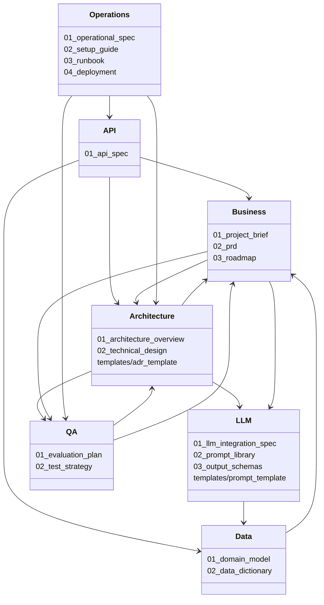

# Índice Maestro de Documentación (`docs/`)

Este índice define la **estructura base de documentación** para proyectos que requieran:

- modelado de dominio
- procesamiento de datos
- integración con IA/LLM (opcional)
- validación y testing

La estructura sigue una progresión lógica:

```text
Estrategia → Modelo → Arquitectura → IA → QA → Operación
```

---

# 📂 01. Business & Strategy (El "Por qué")

- `01_project_brief.md`
  Visión general, alcance y restricciones.

- `02_prd.md`
  Requisitos funcionales y criterios de aceptación.

- `03_roadmap.md`
  Evolución prevista del sistema.

---

# 📂 02. Data & Logic (El "Qué")

- `01_domain_model.md`
  Entidades, relaciones y reglas del dominio.

- `02_data_dictionary.md`
  Definición de campos, tipos y restricciones.

---

# 📂 03. Architecture & Design (El "Cómo")

- `01_architecture_overview.md`
  Visión general del sistema y flujo de datos.

- `02_technical_design.md`
  Diseño técnico detallado de componentes.

- `adr/`
  Registro de decisiones arquitectónicas.

---

# 📂 04. API (Contrato de Integración)

Define la interfaz del sistema hacia el exterior.

- `01_api_spec.md`  
  Especificación funcional de la API:
  - endpoints
  - operaciones
  - comportamiento esperado

- `templates/openapi_template.yaml`  
  Plantilla base OpenAPI:
  - definición formal del contrato
  - modelos de datos expuestos
  - códigos de respuesta

---
# 📂 05. LLM & AI Spec (Opcional)

- `01_llm_integration_spec.md`
  Integración del modelo en el sistema.

- `02_prompt_library.md`
  Definición y versionado de prompts.

- `03_output_schemas.md`
  Contrato de salida esperado.

---

# 📂 06. QA & Validation (La Calidad)

- `01_evaluation_plan.md`
  Métricas y criterios de evaluación.

- `02_test_strategy.md`
  Estrategia de testing.

---

# 📂 07. Operations & Deployment (El "Dónde")

- `01_operational_spec.md`
  Requisitos de entorno.

- `02_setup_guide.md`
  Guía de instalación y ejecución.

- `03_runbook.md`  
  Procedimientos operativos detallados para operación continua y gestión de incidencias.

- `04_deployment.md`  
  Estrategias de despliegue y gestión de entornos.  

---

# 🗺️ Mapa de Referencias

Fuente de verdad de las relaciones entre documentos del framework.
Utilizado por `tools/update_related_documents.py` y `tools/update_index.py`.

Para modificar las referencias de un documento, editar este bloque y re-ejecutar los scripts.

<!-- MERMAID_START -->

<!-- MERMAID_END -->

```yaml
reference_map:
  business/01_project_brief.md:
    - business/02_prd.md
    - architecture/01_architecture_overview.md

  business/02_prd.md:
    - business/01_project_brief.md
    - architecture/01_architecture_overview.md
    - llm/01_llm_integration_spec.md
    - qa/01_evaluation_plan.md

  business/03_roadmap.md:
    - business/01_project_brief.md
    - business/02_prd.md

  data/01_domain_model.md:
    - business/01_project_brief.md
    - business/02_prd.md
    - data/02_data_dictionary.md

  data/02_data_dictionary.md:
    - business/02_prd.md
    - data/01_domain_model.md

  architecture/01_architecture_overview.md:
    - business/01_project_brief.md
    - business/02_prd.md
    - architecture/02_technical_design.md
    - llm/01_llm_integration_spec.md
    - qa/01_evaluation_plan.md

  architecture/02_technical_design.md:
    - business/01_project_brief.md
    - business/02_prd.md
    - architecture/01_architecture_overview.md
    - llm/01_llm_integration_spec.md
    - qa/01_evaluation_plan.md

  architecture/templates/adr_template.md:
    - architecture/01_architecture_overview.md
    - architecture/02_technical_design.md

  api/01_api_spec.md:
    - business/02_prd.md
    - architecture/01_architecture_overview.md
    - data/01_domain_model.md
    - data/02_data_dictionary.md

  llm/01_llm_integration_spec.md:
    - llm/02_prompt_library.md
    - llm/03_output_schemas.md
    - data/01_domain_model.md
    - data/02_data_dictionary.md

  llm/02_prompt_library.md:
    - llm/01_llm_integration_spec.md
    - llm/03_output_schemas.md
    - data/02_data_dictionary.md

  llm/03_output_schemas.md:
    - llm/01_llm_integration_spec.md
    - llm/02_prompt_library.md
    - data/01_domain_model.md
    - data/02_data_dictionary.md

  llm/templates/prompt_template.md:
    - llm/02_prompt_library.md
    - llm/03_output_schemas.md
    - data/02_data_dictionary.md

  qa/01_evaluation_plan.md:
    - business/01_project_brief.md
    - business/02_prd.md
    - architecture/02_technical_design.md

  qa/02_test_strategy.md:
    - qa/01_evaluation_plan.md
    - architecture/02_technical_design.md

  operations/01_operational_spec.md:
    - architecture/02_technical_design.md
    - qa/01_evaluation_plan.md
    - api/01_api_spec.md

  operations/02_setup_guide.md:
    - operations/01_operational_spec.md
    - architecture/02_technical_design.md

  operations/03_runbook.md:
    - operations/01_operational_spec.md
    - operations/02_setup_guide.md
    - architecture/02_technical_design.md

  operations/04_deployment.md:
    - operations/01_operational_spec.md
    - operations/02_setup_guide.md
    - architecture/02_technical_design.md
```

---

# 📊 Estado de las Plantillas

<!-- STATUS_TABLE_START -->
| Área | Documento | Estado | Notas |
| ---- | --------- | ------ | ----- |
| Business | 01_project_brief.md | 🔵 Draft | |
| Business | 02_prd.md | 🔵 Draft | |
| Business | 03_roadmap.md | 🔵 Draft | |
| Data | 01_domain_model.md | 🔵 Draft | |
| Data | 02_data_dictionary.md | 🔵 Draft | |
| Architecture | 01_architecture_overview.md | 🔵 Draft | |
| Architecture | 02_technical_design.md | 🔵 Draft | |
| Architecture | templates/adr_template.md | 🔵 Draft | |
| API | 01_api_spec.md | 🔵 Draft | |
| LLM | 01_llm_integration_spec.md | 🔵 Draft | |
| LLM | 02_prompt_library.md | 🔵 Draft | |
| LLM | 03_output_schemas.md | 🔵 Draft | |
| LLM | templates/prompt_template.md | 🔵 Draft | |
| QA | 01_evaluation_plan.md | 🔵 Draft | |
| QA | 02_test_strategy.md | 🔵 Draft | |
| Operations | 01_operational_spec.md | 🔵 Draft | |
| Operations | 02_setup_guide.md | 🔵 Draft | |
| Operations | 03_runbook.md | 🔵 Draft | |
| Operations | 04_deployment.md | 🔵 Draft | |
<!-- STATUS_TABLE_END -->

---

# 🧭 Principios de uso

- cada documento tiene una responsabilidad clara
- evitar solapamiento entre documentos
- mantener separación entre capas
- la integración con IA/LLM es opcional

---

# ⚠️ Alcance de esta estructura

Esta estructura define:

- organización de la documentación
- responsabilidades de cada documento

No define:

- estado de un proyecto concreto
- progreso de implementación
- decisiones específicas de un caso particular

---

# 🔄 Fases de Evolución del Framework

## Fase 1 — Definición de Plantillas (Actual)

Objetivo:

- definir estructura base
- asegurar separación de responsabilidades
- establecer consistencia entre documentos

Características:

- documentación descriptiva
- enfoque conceptual
- independencia de implementación

---

## Fase 2 — Aplicación en Proyecto Real

Objetivo:

- validar las plantillas en un caso real
- detectar fricciones y ambigüedades
- ajustar estructura y contenido

Actividades:

- instanciación de documentos
- uso en desarrollo real
- identificación de gaps

---

## Fase 3 — Hardening (IA Assisted Development)

Objetivo:

- hacer la documentación operativa para IA
- reducir ambigüedad
- permitir generación y validación automática

---

### Componentes del Hardening

#### 1. Criterios de uso

- cuándo usar el documento
- cuándo NO usarlo
- qué decisiones se toman aquí

---

#### 2. Reglas de generación

- no inventar información
- no duplicar conceptos
- respetar estructura del documento
- mantener terminología consistente

---

#### 3. Reglas de consistencia

- entidades coherentes entre documentos
- nombres alineados
- estados consistentes

---

#### 4. Validaciones explícitas

- cada entidad tiene identidad
- cada campo tiene tipo
- cada estado tiene transición válida

---

#### 5. Gestión de incertidumbre

- marcar información inferida
- no asumir valores faltantes
- explicitar confianza

---

#### 6. Trazabilidad

Cada elemento debe poder relacionarse con:

- entidad
- dato
- requisito

---

#### 7. Reglas de evolución

- cómo añadir nuevos elementos
- cómo modificar sin romper coherencia

---

#### 8. Control de alcance

Evitar mezcla entre capas:

- Domain ≠ Data
- API ≠ implementación

---

#### 9. Convenciones estrictas

- naming consistente
- formatos definidos
- estructuras homogéneas

---

#### 10. Plantillas ejecutables

- estructura fija
- secciones obligatorias
- ejemplos claros

---

## Aplicación

En esta fase se añadirá en cada documento:

```text
## Anexo. Criterios de Uso (IA Assisted)
```

---

## Resultado esperado

- reducción de ambigüedad
- coherencia entre documentos
- facilidad de generación automática
- validación cruzada fiable

---

## Recordatorio clave

- no aplicar este framework en fase de diseño inicial
- aplicar tras detectar problemas reales en uso
