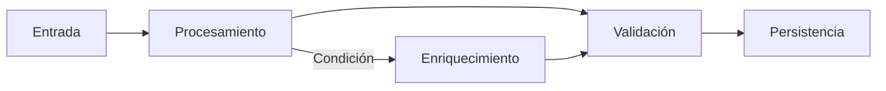

# Technical Design Document (TDD)

## 1. Introducción

Este documento define el **diseño técnico del sistema**, traduciendo la arquitectura definida en el Architecture Overview en una **implementación concreta y ejecutable**.

Debe especificar:

- estructura del código  
- tecnologías y herramientas  
- flujos de ejecución del sistema  
- integración con dependencias técnicas  
- gestión de errores y recursos  

Este documento sirve como base directa para la implementación.

---

### Ejemplo
> Este documento describe cómo implementar un sistema modular con procesamiento local, integración con modelos LLM y persistencia estructurada.

---

## 2. Principios de Diseño

Definir los principios técnicos que guían la implementación.

- [Principio 1]
- [Principio 2]
- [Principio 3]

---

### Ejemplo

- Desacoplamiento mediante interfaces  
- Minimizar consumo de recursos  
- Evitar dependencias externas  
- Validación estricta de datos  

---

## 3. Lenguaje, Runtime y Convenciones de Implementación

Definir el lenguaje principal de implementación, versión objetivo, runtime y convenciones técnicas del proyecto.

### Lenguaje principal

- Lenguaje:
- Versión mínima:
- Justificación:

### Runtime / entorno de ejecución

- Runtime:
- Sistema operativo objetivo:
- Gestor de dependencias:
- Herramientas de empaquetado:

### Convenciones de desarrollo

- Tipado:
- Formato de código:
- Linting:
- Testing:
- Gestión de configuración:

---

### Ejemplo

- Lenguaje: Python  
- Versión mínima: 3.11  
- Runtime: entorno local  
- Gestor de dependencias: uv / pip / poetry  
- Tipado: type hints obligatorios  
- Modelos de datos: Pydantic  
- Testing: pytest  

---

## 4. Arquitectura de Código (Módulos y Paquetes)

Definir la organización del código fuente.

- módulos principales  
- responsabilidades  
- dependencias entre módulos  

---

### Estructura

```

/src
/ingest
/processing
/analysis
/llm
/validation
/storage
/orchestration
/errors
/config

```

---

### Ejemplo

- `ingest`: entrada de datos  
- `processing`: transformación  
- `llm`: integración con modelos  
- `validation`: validación de outputs  
- `storage`: persistencia  

---

## 5. Flujos de Ejecución del Sistema

Describir cómo se comporta el sistema en runtime, incluyendo:

- secuencias de ejecución  
- interacciones entre módulos  
- condiciones de decisión  
- manejo de estados  

Debe ponerse especial énfasis en el **dato en tránsito**:

- qué objeto exacto se pasa entre módulos  
- formato de datos (JSON, objetos tipados, paths, etc.)  
- transformaciones que sufre en cada etapa  

---

### Tipos de flujo

- Flujo principal  
- Flujos alternativos  
- Flujos de error  
- Flujos asíncronos (si aplica)  

---

### Ejemplo

```text
Input (Path) → Documento (Objeto) → Datos (JSON) → Resultado Validado
```

---

### Ejemplo (flujo secuencial)

```text
Entrada → Procesamiento → Validación → Persistencia
```

---

### Ejemplo (flujo condicional)

```text
Entrada → Procesamiento
        → [Condición] → Enriquecimiento
        → Validación → Persistencia
```

---

### Ejemplo (event-driven)

```text
Evento → Handler → Procesamiento → Evento → Persistencia
```

---

### Representación opcional



---

### Consideraciones

- qué datos se intercambian
- cómo evolucionan
- cómo se controlan estados

---

## 6. Integración con Componentes Externos (Opcional)

Definir cómo se integran dependencias técnicas.

- modelos LLM
- motores de procesamiento
- herramientas externas

---

### Ejemplo

- Integración con motor LLM local
- Uso de librerías de parsing
- Uso de OCR cuando sea necesario

---

## 7. Diseño de Datos y Persistencia

Definir cómo se almacenan los datos.

- estructura de datos
- modelos
- base de datos
- validación

---

### Ejemplo

- Base de datos local
- Modelos tipados
- Validación mediante schemas

---

## 8. Gestión de Recursos

Definir cómo se gestionan los recursos del sistema:

- CPU
- GPU
- memoria
- almacenamiento

Debe incluir una **estrategia activa de gestión**.

---

### Lifecycle de recursos críticos

- cuándo se inicializan
- cuándo se utilizan
- cuándo se liberan

---

### Ejemplo

- Carga de modelo bajo demanda
- Liberación de memoria tras inferencia
- Control de concurrencia

---

### Consideraciones

- evitar bloqueos
- minimizar uso de GPU
- priorizar estabilidad

---

## 9. Gestión de Errores y Resiliencia

Definir el comportamiento técnico ante errores.

- tipos de error
- estrategias
- recuperación

---

### Ejemplo

- Retry en errores recuperables
- Fail-fast en errores críticos
- Validación de outputs del modelo

---

## 10. Configuración y Entorno

Definir configuración técnica del sistema.

- variables de entorno
- configuración de ejecución
- dependencias

---

### Ejemplo

- `.env`
- parámetros del modelo
- rutas

---

## 11. Observabilidad y Logging

Definir cómo se monitoriza el sistema:

- logs
- métricas
- trazabilidad

---

### Métricas de sistema

- latencia
- errores
- throughput

---

### Métricas de modelo (IA) (Opcional)

- score de confianza
- calidad del output
- tasa de outputs inválidos

---

### Ejemplo

- logging de inferencias
- trazabilidad por documento

---

### Consideraciones

- separar métricas técnicas vs modelo

---

## 12. Seguridad

Definir consideraciones de seguridad.

- acceso a datos
- aislamiento
- protección

---

### Ejemplo

- procesamiento local
- no exposición externa

---

## 13. Decisiones Técnicas (ADR)

Las decisiones técnicas se documentan en:

```
/architecture/adr/
```

El TDD solo refleja el resultado de dichas decisiones.

---

## 14. Limitaciones Técnicas

Definir las limitaciones del sistema (no errores).

---

### Tipos

- hardware
- tamaño de datos
- tiempo de procesamiento
- capacidad del modelo

---

### Ejemplo

- límite de tamaño de archivo
- limitaciones de memoria

---

### Consideraciones

- diferenciar error vs limitación

---

## Anexo. Notas de Coworking (IA Assistant)

### Contexto

Este documento define la implementación técnica del sistema.

---

### Supuestos

- ...
- ...

---

### Ejemplo

- recursos limitados
- uso de modelos probabilísticos

---

### Instrucciones

- no introducir dependencias externas
- mantener coherencia con arquitectura
- no mezclar niveles
- validar consistencia con PRD

---

### Riesgos

- ...
- ...

---

### Ejemplo

- fallos en inferencia
- problemas de memoria

---

### Dudas abiertas

- ...
- ...

---

### Ejemplo

- paralelización
- optimización

### Inputs utilizados

- ...


### Insights clave

- ...


