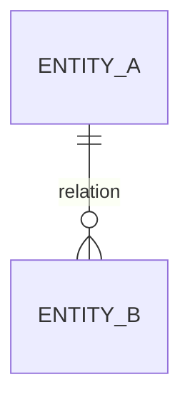
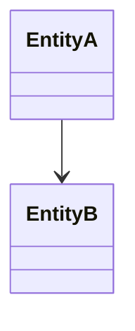

# Domain Model

## 1. Introducción

Este documento define el **modelo de dominio del sistema**, describiendo los conceptos clave, entidades y relaciones que representan el problema a resolver.

Su objetivo es:

- establecer un lenguaje común  
- definir entidades y relaciones  
- definir comportamiento del sistema  
- servir como base para API, persistencia y procesamiento  

Este documento no define:

- estructura de base de datos  
- endpoints de API  
- detalles de implementación  

---

### Ejemplo

> El sistema gestiona documentos, procesos de análisis y resultados estructurados derivados de su procesamiento.

---

## 2. Alcance del Modelo

### Incluido

- entidades principales  
- relaciones entre entidades  
- estados del dominio  
- reglas de negocio  
- eventos  

### Excluido

- persistencia física  
- APIs  
- lógica técnica  

---

## 3. Glosario de Dominio

| Término | Definición |
|--------|------------|
|        |            |

---

### Ejemplo

| Término | Definición |
|--------|------------|
| Documento | Unidad de entrada procesable |
| Job | Proceso asociado |
| Resultado | Información generada |

---

## 4. Entidades del Dominio

---

### 4.1 `[Entidad]`

Descripción:
- ...

Responsabilidad:
- ...

---

### Identidad lógica

Definir qué hace única a la entidad.

- campos de identidad:
- criterio de unicidad:
- estrategia de deduplicación:

---

### Atributos (conceptuales)

| Campo | Tipo lógico | Obligatorio | Descripción |
|------|-------------|-------------|-------------|

---

### Relaciones

- ...

---

### Reglas

- ...

---

### Ejemplo

### `Document`

Descripción:
- Representa una unidad de entrada.

Identidad:
- combinación de fuente + identificador externo

---

## 5. Relaciones entre Entidades

---

### Cardinalidad

* uno a uno
* uno a muchos
* muchos a muchos

---

### Ownership

Definir qué entidad controla la relación.

---

## 6. Estados del Dominio

---

### `[Entidad]`

| Estado | Descripción | Terminal |
| ------ | ----------- | -------- |

---

### Transiciones de estado

| Estado origen | Estado destino | Condición |
| ------------- | -------------- | --------- |

---

### Ejemplo

### `Job`

| Estado    | Descripción                              | Terminal |
| --------- | ---------------------------------------- | -------- |
| queued    | pendiente de procesamiento               | no       |
| running   | procesamiento en curso                   | no       |
| completed | procesamiento finalizado con éxito       | sí       |
| failed    | procesamiento finalizado con error       | sí       |

---

### Transiciones de estado

### `Job`

| Estado origen | Estado destino | Condición                                        |
| ------------- | -------------- | ------------------------------------------------ |
| queued        | running        | procesamiento iniciado                           |
| running       | completed      | procesamiento finalizado sin error               |
| running       | failed         | error no recuperable o reintentos agotados       |
| failed        | queued         | retry solicitado dentro del límite de reintentos |

---

## 7. Reglas de Dominio

Definir reglas que gobiernan el comportamiento del dominio.

---

### 7.1 Reglas obligatorias

Reglas que siempre deben cumplirse.

#### Ejemplo

* no pueden existir entidades duplicadas
* un resultado debe ser validado

---

### 7.2 Reglas opcionales

Reglas que mejoran la calidad del sistema.

#### Ejemplo

* normalización de valores
* enriquecimiento de datos

---

### 7.3 Reglas de inferencia

Definen cómo se deduce información.

#### Ejemplo

* inferir valores desde contexto
* registrar origen de inferencia

---

### 7.4 Reglas de confianza

Gestionan datos con incertidumbre.

#### Ejemplo

* campos críticos requieren alta confianza
* datos dudosos pueden ser rechazados

---

### 7.5 Aplicación de reglas

* cuándo se evalúan
* qué ocurre si fallan
* cómo se registran

---

## 8. Eventos de Dominio

| Evento | Descripción | Entidad origen |
| ------ | ----------- | -------------- |

---

### Relación con estados

* eventos que disparan cambios
* eventos que reflejan cambios

---

### Ejemplo

| Evento     | Descripción    | Entidad |
| ---------- | -------------- | ------- |
| JobStarted | inicio proceso | Job     |

---

## 9. Errores de Dominio

| Error | Descripción | Recuperable |
| ----- | ----------- | ----------- |

---

### Ejemplo

| Error        | Descripción      | Recuperable |
| ------------ | ---------------- | ----------- |
| InvalidInput | entrada inválida | no          |

---

## 10. Invariantes del Dominio

Condiciones que siempre deben cumplirse.

---

### Ejemplo

* todo job debe tener documento
* todo resultado válido debe estar validado

---

## 11. Modelo Conceptual

---

### Agregados

| Agregado | Raíz | Entidades | Regla |
| -------- | ---- | --------- | ----- |

---

### Ejemplo

| Agregado            | Raíz | Entidades     | Regla                |
| ------------------- | ---- | ------------- | -------------------- |
| ProcessingAggregate | Job  | Result, Error | consistencia interna |

---

## 12. Límites del Dominio

Definir qué pertenece al dominio.

---

### Incluye

* conceptos centrales

### Excluye

* implementación
* infraestructura
* APIs

---

## 13. Relación con otros modelos

Cada entidad definida en este documento debe tener, si aplica, una sección correspondiente en `02_data_dictionary.md`.

### Data Dictionary

* define atributos y tipos

### API

* expone vistas del dominio

### Persistencia

* implementa este modelo

---

## 14. Limitaciones y Dudas

* ...

---

## Anexo. Criterios de Uso (IA Assisted)

Este documento debe completarse cuando:

- existan nuevas entidades del dominio
- cambien reglas de negocio
- se añadan campos estructurados
- cambien restricciones de datos

No debe usarse para:

- definir endpoints
- definir tablas físicas
- documentar implementación

---

## Anexo. Notas de Coworking (IA Assistant)

### Instrucciones

* no introducir detalles técnicos
* no definir persistencia
* no definir endpoints
* mantener coherencia conceptual

---

### Riesgos

* acoplar dominio a implementación
* duplicar lógica
* omitir invariantes

---

### Dudas abiertas

* ...

### Contexto

- ...

### Inputs utilizados

- ...

### Insights clave

- ...

